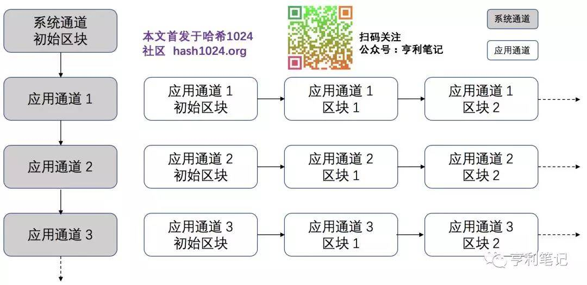

# Fabric部署
## 基本术语
#### 区块链的本质
参考文章：[区块链的本质](http://www.ruanyifeng.com/blog/2017/12/blockchain-tutorial.html)
<!--TODO 有时间，自己重新组织一遍-->
#### Fabric的程序模块组成
Fabric不是一个单独的程序而是由一组模块组成，这些模块中的每一个都是一个可独立运行的可执行文件。
|名称|解释|
|--|--|   
|peer|主节点模块，负责存储区块链数据，运行维护链码；|
|orderer|负责对交易进行排序，并将排好序的交易打包成区块；|
|cryptogen|组织和证书生成模块；|
|configtxgen|区块和交易生成模块；|
|configtxlator|区块和交易解析模块。|
   开发一个Fabric应用都需要这些模块的参与。
#### 节点Peer
Peer节点是一个物理的概念（与之对比，通道(Channel)是一个逻辑的概念，通道(Channel)并没有实体），一台服务器可以充当Peer的作用。
 Peer节点存储关键的数据，并且执行特定的程序。存储的数据包括账本、链码（智能合约），执行的程序主要包括背书以及链码的执行。所有的账本查询以及账本修改必须通过链码来操作，所有的链码操作必须通过Peer节点在唤起，所以SDK或者应用需要存取账本数据时，必须通过Peer。这就是为什么说Peer是Fabric的基础设施。
一个组织可以有一个或者多个Peer。而一个Peer可以加入一个或者多个通道(Channel)中，
<!--TODO peer的猜测 一个peer节点需要一个docker-->
#### 通道(Channel)
通道分为系统通道（System Channel）和应用通道（Application Channel）。排序节点通过系统通道来管理应用通道，用户的交易信息通过应用通道传递。对一般用户来说，通道是指应用通道。系统通道与应用通道的关系如下图：
 
<!--TODO 发布时，修改图片地址-->
通道由排序服务节点负责管理，同时该节点还负责排序通道中的交易。
#### 组织
#### cryptogen服务器
cryptogen是用来生产fabric需要的证书的；这个生产过程是静态的。
参考文章：[cryptogen服务器使用](https://www.jianshu.com/p/9d031a0606b7)
#### configtxgen服务器

#### fabric-samples部署
本文参考[fabric-samples的下载及自动启动网络脚本演示](https://blog.csdn.net/qq_25870633/article/details/81113464)完成
1. 先查看当前存在的Docker镜像
   ```
   sudo docker images
   ```
   如果出现如下信息，表示存在一个叫“hello-world”的镜像
   ```
   sudo REPOSITORY     TAG                 IMAGE ID            CREATED             SIZE
   hello-world         latest              bf756fb1ae65        10 months ago       13.3kB
   ```
2. 删除已经存在的镜像，排除干扰
   ```
   sudo docker rmi bf756fb1ae65
   ```
   这里的bf756fb1ae65是镜像的“IMAGE ID"，需要根据你的机器具体修改
   如果出现错误提示
   ```
   Error response from daemon: conflict: unable to delete bf756fb1ae65 (must be forced) - image is being used by stopped container 3ffe1759aaa0
   ```
   表示镜像正在运行，强制删除镜像
   ```
   sudo docker rmi -f bf756fb1ae65
   ```
3. 返回用户home目录
   ```
   cd
   ```
4. 使用curl下载脚本
   ```
   curl -sSL https://bit.ly/2ysbOFE | get-babric.sh -s
   #该地址被墙，执行出错
   #从
   #https://github.com/hyperledger/fabric/blob/master/scripts/bootstrap.sh
   #手动复制文件内容，粘贴到本地get-babric.sh文件中
   ```
   
5. 执行脚本
   ```
   sudo sh ./get-fabric.sh
   ```
6. 运行


---
备注

[Hyperledger Fabric2中文文档-快速入门](https://blog.csdn.net/zhanglingge/article/details/106717738)

[Hyperledger Fabric 一文了解MSP的目录结构](https://blog.csdn.net/zhanglingge/article/details/107484553)


https://github.com/hyperledger/fabric/releases/download/v2.2.1/hyperledger-fabric-linux-amd64-2.2.1.tar.gz